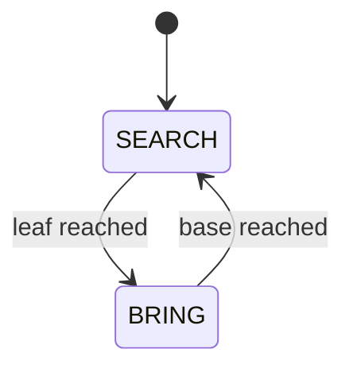
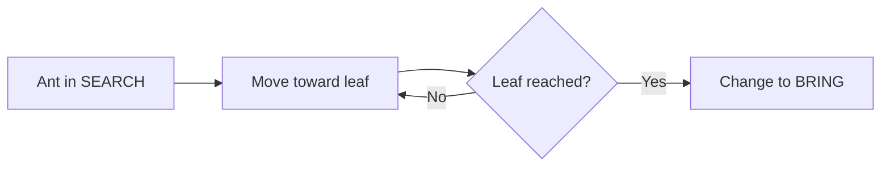
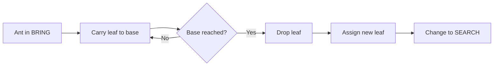
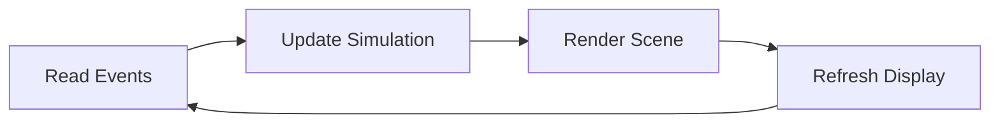

# 🐜 Cleaner Ants State Machine

<p>
  
  
  
  
  
  
</p>

A simple **Pygame-based finite state machine simulation** with multiple autonomous ants collecting leaves and bringing them back to a centralized base.

This project explores the use of **finite state machines**, **2D vector movement**, **object-oriented programming**, and **agent-based behavior** in a small visual simulation. Each ant is controlled by a simple state machine and alternates between searching for a leaf and bringing it back to the central base.

---

## 📌 Overview

The simulation contains **20 autonomous ants** moving inside a 2D Pygame window.

<p align="center">
  
</p>

<p align="center">
  <em>Ant reference image: <a href="https://commons.wikimedia.org/wiki/File:Ant_on_the_wall.jpg">Wikimedia Commons — Ant on the wall.jpg</a></em>
</p>


Each ant has its own target leaf and follows a simple behavior cycle:

```text
SEARCH → BRING → SEARCH
```

The behavior works as follows:

- In the **SEARCH** state, the ant moves toward a leaf.
- When the ant reaches the leaf, it switches to the **BRING** state.
- In the **BRING** state, the ant carries the leaf back to the central base.
- When the ant reaches the base, a new leaf is assigned and the ant returns to the **SEARCH** state.

This creates a continuous simulation of multiple agents collecting objects and returning them to a shared location.

The project is intentionally simple and educational. It is useful for studying how small local rules can generate visible agent behavior in a simulation.

---

## 🧭 Conceptual Map

```mermaid
graph TD
    A[Cleaner Ants State Machine] --> B[Finite State Machine]
    A --> C[2D Vector Movement]
    A --> D[Multi-Agent Simulation]
    A --> E[Pygame Game Loop]
    A --> F[Object-Oriented Design]

    B --> B1[SEARCH State]
    B --> B2[BRING State]
    B --> B3[State Transitions]

    C --> C1[Position]
    C --> C2[Target]
    C --> C3[Direction]
    C --> C4[Distance]
    C --> C5[Velocity]

    D --> D1[20 Ants]
    D --> D2[Individual Leaf Targets]
    D --> D3[Shared Central Base]

    E --> E1[Handle Events]
    E --> E2[Update Agents]
    E --> E3[Draw Scene]
    E --> E4[Refresh Display]

    F --> F1[Vector2D]
    F --> F2[State]
    F --> F3[StateMachine]
    F --> F4[Entity]
    F --> F5[CleanerAnt]
```



---

## ✅ Main Usage per File

| File | Description |
|---|---|
| `main.py` | Runs the visual simulation with 20 ants, random leaf targets, and a centralized base. |
| `simulation.py` | Contains reusable simulation classes, including vectors, entities, states, state machines, worlds, and central entities. |
| `ant.png` | Image asset used to represent each ant. |
| `leaf.png` | Image asset used to represent the collectible leaf. |
| `demo.mp4` | Demo video or project recording. |
| `README.md` | Project documentation. |

---

## 📂 Repository Structure

```text
Cleaner Ants State Machine/
│
├── ant.png
├── demo.mp4
├── leaf.png
├── main.py
├── README.md
└── simulation.py
```

---

## 📘 Computational Concepts

This project demonstrates several important computational concepts:

```text
Finite State Machines
2D Vector Movement
Object-Oriented Programming
Agent-Based Simulation
Autonomous Entity Behavior
Game Loop Architecture
Real-Time Rendering
```

---

## 🧭 Finite State Machine

A finite state machine is a computational model where an entity can be in one state at a time and switch to another state based on specific conditions.

<p align="center">
  
</p>

<p align="center">
  <em>Finite state machine reference: <a href="https://commons.wikimedia.org/wiki/File:Finite-state_machine_state-diagram.png">Wikimedia Commons — Finite-state machine state-diagram.png</a></em>
</p>


In this project, each ant uses two main states:

```text
SEARCH
BRING
```

The state cycle is:



---

## 🧮 State Machine Model

A finite state machine can be represented as:

$$
M = (S, I, T, s_0)
$$

where:

- $S$ is the set of possible states
- $I$ is the set of input events or transition conditions
- $T$ is the transition function
- $s_0$ is the initial state

For this simulation:

$$
S = \{\text{SEARCH}, \text{BRING}\}
$$

The transition rules can be described as:

$$
T(\text{SEARCH}, \text{leaf reached}) = \text{BRING}
$$

$$
T(\text{BRING}, \text{base reached}) = \text{SEARCH}
$$

This small state machine is enough to produce continuous collecting behavior.

---

## 🔎 `SEARCH` State

In this state, the ant moves toward its assigned leaf.

When the ant gets close enough to the leaf, the state machine changes to:

```text
BRING
```

Main behavior:

```text
set target = leaf position
set speed = ant speed
check distance to leaf

if distance <= capture distance:
    change state to BRING
```

Conceptually:



---

## 🍃 `BRING` State

In this state, the ant carries the leaf back to the central base.

When the ant reaches the base, a new leaf position is generated and the state machine changes back to:

```text
SEARCH
```

Main behavior:

```text
set target = base position
set speed = ant speed
check distance to base

if distance <= base radius:
    drop leaf
    assign new leaf
    change state to SEARCH
```

Conceptually:



---

## 📐 2D Vector Movement

The simulation uses a custom `Vector2D` class to represent:

- Position
- Target position
- Direction
- Distance
- Movement
- Vector arithmetic

<p align="center">
  
</p>

<p align="center">
  <em>Vector addition reference: <a href="https://commons.wikimedia.org/wiki/File:Vector-addition-and-scaling.svg">Wikimedia Commons — Vector-addition-and-scaling.svg</a></em>
</p>

Each ant moves by calculating the direction between its current position and its target position.

Simplified movement logic:

```text
direction = target_position - current_position
distance = magnitude(direction)
unit_direction = normalize(direction)
movement = unit_direction * speed * elapsed_time
new_position = current_position + movement
```

Mathematically, if the ant is at position $p$ and the target is $t$, the movement direction is:

$$
d = t - p
$$

The normalized direction is:

$$
\hat{d} = \frac{d}{\|d\|}
$$

The new position after a time step $\Delta t$ is:

$$
p_{new} = p + \hat{d} \cdot v \cdot \Delta t
$$

where:

- $p$ is the current position
- $t$ is the target position
- $v$ is the ant speed
- $\Delta t$ is the elapsed time
- $\hat{d}$ is the unit direction vector

---

## 🐜 Multi-Agent Behavior

The current simulation creates:

```text
20 ants
```

Each ant has:

- Its own position
- Its own target leaf
- Its own state machine
- Its own carrying status
- A shared central base

Even though the ants use the same rules, their randomized leaf positions create different movement patterns.

Conceptually:

```text
Central Base
     │
     ├── Ant 1  → SEARCH / BRING
     ├── Ant 2  → SEARCH / BRING
     ├── Ant 3  → SEARCH / BRING
     ├── ...
     └── Ant 20 → SEARCH / BRING
```

This is a small example of **agent-based simulation**, where each agent follows local rules and the global behavior emerges from many independent updates.

---

## 🏠 Central Base

The base is placed at the center of the simulation window.

It works as the delivery point for all ants. When an ant reaches the base while carrying a leaf, the leaf is considered delivered, and the ant receives a new leaf target.

The central base is drawn as a circle:

```text
        . . . . .
     .             .
   .       ●         .
     .             .
        . . . . .

     CENTRAL BASE
```

---

## 🎮 Game Loop

The simulation runs inside a standard real-time game loop.

Simplified loop:

```text
while running:
    read events
    update ants
    clear screen
    draw base
    draw leaves
    draw ants
    draw text information
    update display
```

The loop runs at the configured frame rate:

```python
FPS = 60
```

A common game loop structure can be represented as:



---

## 🧱 Current Architecture

### `simulation.py`

Contains reusable simulation classes.

| Class | Purpose |
|---|---|
| `Vector2D` | Represents 2D positions, distances, directions, and movement. |
| `State` | Base class for finite states. |
| `StateMachine` | Controls the active state of an entity. |
| `IdleState` | Basic placeholder idle state. |
| `MoveState` | Basic placeholder movement state. |
| `MiniWorld` | Represents a simple 2D world with entities and a background. |
| `Entity` | Base class for moving objects in the simulation. |
| `Central` | Specialized entity concept for centralized behavior and control radius. |

---

### `main.py`

Contains the executable simulation logic.

| Class / Function | Purpose |
|---|---|
| `SearchState` | Makes the ant search for a leaf. |
| `BringState` | Makes the ant bring the leaf back to the base. |
| `CleanerAnt` | Represents one ant controlled by a finite state machine. |
| `create_random_leaf_position()` | Creates a random target leaf position away from the base. |
| `assign_new_leaf()` | Assigns a new target leaf after delivery. |
| `create_start_position()` | Places ants around the base instead of stacking them at one point. |
| `draw_text()` | Draws text on the Pygame screen. |
| `draw_base()` | Draws the central base. |
| `main()` | Initializes Pygame and runs the simulation loop. |

---

## ⏱️ Time and Space Complexity

Let:

```text
A = number of ants
S = number of states per ant
E = number of entities in a MiniWorld
F = number of rendered frames
P = number of Pygame events in one frame
```

In the current simulation:

```text
A = 20
S = 2
```

The constants are small, but analyzing complexity helps explain how the simulation scales if more ants or states are added.

---

### Main Simulation Loop Complexity

Each frame performs these main steps:

```text
1. Process Pygame events
2. Update all ants
3. Draw the base
4. Draw all leaves
5. Draw all ants
6. Count ants by state
7. Draw interface text
8. Flip the display
```

The per-frame cost is mostly linear in the number of ants.

| Step | Time Complexity | Space Complexity | Explanation |
|---|---:|---:|---|
| Event handling | $O(P)$ | $O(1)$ | $P$ is the number of Pygame events in the frame. |
| Updating all ants | $O(A)$ | $O(1)$ | Each ant processes its state machine and movement. |
| Drawing all leaves | $O(A)$ | $O(1)$ | Each ant has one leaf target or carried leaf. |
| Drawing all ants | $O(A)$ | $O(1)$ | Each ant sprite is drawn once. |
| Counting states | $O(A)$ | $O(1)$ | The program scans all ants and counts `SEARCH` / `BRING` states. |
| Drawing UI text | $O(1)$ | $O(1)$ | Fixed number of text labels. |
| Total per frame | $O(A + P)$ | $O(1)$ | Main cost grows linearly with the number of ants. |

For $F$ frames:

$$
O(F \cdot (A + P))
$$

If the number of events per frame is treated as small, this becomes:

$$
O(F \cdot A)
$$

---

### State Machine Complexity

Each ant has a small finite state machine with two states.

| Operation | Time Complexity | Space Complexity | Explanation |
|---|---:|---:|---|
| Add one state | $O(1)$ average | $O(1)$ | States are stored in a dictionary by name. |
| Change state | $O(1)$ average | $O(1)$ | Dictionary lookup by state name. |
| Execute current state | $O(1)$ | $O(1)$ | Only one active state runs at a time. |
| Check transition | $O(1)$ | $O(1)$ | Distance check to leaf or base. |
| Per ant per frame | $O(1)$ | $O(1)$ | Constant work for each ant. |
| All ants per frame | $O(A)$ | $O(1)$ | Every ant is processed once. |

Because each ant has only two states, the state machine overhead is constant.

---

### Vector Operation Complexity

The `Vector2D` class performs constant-time arithmetic.

| Operation | Time Complexity | Space Complexity |
|---|---:|---:|
| Addition | $O(1)$ | $O(1)$ |
| Subtraction | $O(1)$ | $O(1)$ |
| Scalar multiplication | $O(1)$ | $O(1)$ |
| Division | $O(1)$ | $O(1)$ |
| Magnitude | $O(1)$ | $O(1)$ |
| Normalization | $O(1)$ | $O(1)$ |
| Distance calculation | $O(1)$ | $O(1)$ |

Each movement update uses a constant number of vector operations.

---

### Leaf Generation Complexity

Each ant receives a random leaf position away from the base.

The function uses rejection sampling:

```text
generate random position
calculate distance from base

if distance is far enough:
    accept position
else:
    try again
```

| Operation | Time Complexity | Space Complexity | Explanation |
|---|---:|---:|---|
| Generate random leaf | $O(1)$ expected | $O(1)$ | Usually finds a valid point quickly. |
| Worst case | Unbounded theoretical | $O(1)$ | Rejection sampling could theoretically repeat many times. |

In practice, the window is large and the invalid area near the base is small, so this behaves like constant time.

---

### Entity and World Complexity

The reusable `MiniWorld` and `Entity` classes support more general simulations.

| Operation | Time Complexity | Space Complexity | Explanation |
|---|---:|---:|---|
| `MiniWorld.add_entity()` | $O(1)$ average | $O(1)$ | Adds entity to a dictionary. |
| `MiniWorld.remove_entity()` | $O(1)$ average | $O(1)$ | Removes entity by ID from dictionary. |
| `MiniWorld.get()` | $O(1)$ average | $O(1)$ | Dictionary lookup by ID. |
| `MiniWorld.process()` | $O(E)$ | $O(1)$ | Processes every entity in the world. |
| `MiniWorld.draw_background()` | $O(E)$ | $O(1)$ | Draws every entity. |
| `Entity.process()` | $O(1)$ | $O(1)$ | Runs state machine and movement. |
| `Entity.draw()` | $O(1)$ | $O(1)$ | Draws one sprite. |
| `Entity.get_world_vision()` | $O(E)$ | $O(1)$ | Scans world entities to find one visible entity by name. |

The current `main.py` stores ants in a list instead of using `MiniWorld`, but the reusable architecture supports larger entity-based simulations.

---

### Space Complexity Summary

The current simulation stores:

- One list of ants
- One sprite for each ant
- One leaf target position for each ant
- One state machine per ant
- One shared leaf sprite
- One base position
- Fixed UI text values

| Component | Space Complexity |
|---|---:|
| Ant list | $O(A)$ |
| Ant objects | $O(A)$ |
| Leaf positions | $O(A)$ |
| State machines | $O(A \cdot S)$ |
| Shared sprites and constants | $O(1)$ |
| Total space | $O(A \cdot S)$ |

Since $S = 2$, this simplifies to:

$$
O(A)
$$

---

### General Complexity Summary

| Feature | Time Complexity | Space Complexity |
|---|---:|---:|
| One ant update | $O(1)$ | $O(1)$ |
| All ants update per frame | $O(A)$ | $O(1)$ |
| Draw all ants per frame | $O(A)$ | $O(1)$ |
| Draw all leaves per frame | $O(A)$ | $O(1)$ |
| Count ants by state | $O(A)$ | $O(1)$ |
| Generate one new leaf | $O(1)$ expected | $O(1)$ |
| Full frame update | $O(A + P)$ | $O(1)$ |
| Full simulation over $F$ frames | $O(F \cdot A)$ | $O(A)$ |

---

## ▶️ How to Run

### 🔧 Installation

Install Pygame:

```bash
pip install pygame
```

---

### 🚀 Running the Simulation

From the project folder, run:

```bash
python main.py
```

If you are on Windows and using the Python launcher, you can also run:

```powershell
py main.py
```

---

## 🎮 What You Should See

When the program runs, a Pygame window opens with:

- A centralized base
- 20 ants around the environment
- Leaves positioned randomly
- Ants moving toward leaves
- Ants carrying leaves back to the base
- A small text interface showing how many ants are searching and how many are bringing leaves

The simulation continues until the Pygame window is closed.

---

## 🧪 Behavior Summary

```text
1. The simulation starts with 20 ants.
2. Each ant receives a random leaf target.
3. Each ant moves toward its leaf.
4. When an ant reaches a leaf, it switches to BRING.
5. The leaf follows the ant back to the central base.
6. When the ant reaches the base, the leaf is delivered.
7. A new leaf target is generated.
8. The ant starts searching again.
```

---

## 🧰 Technologies and Tools

| Tool / Library | Purpose |
|---|---|
| Python 3 | Main programming language |
| Pygame | Window creation, rendering, sprites, events, and game loop |
| Object-Oriented Programming | Encapsulating agents, states, vectors, and world behavior |
| Finite State Machine | Controlling ant behavior through explicit states |
| 2D Vector Math | Movement, direction, distance, and normalization |
| Random module | Random leaf generation |
| Terminal / Shell | Running the simulation |

---

## 🧠 Educational Notes

This project is an educational prototype focused on basic artificial intelligence concepts.

The main goal is to demonstrate how simple agents can be modeled with:

- Python
- Pygame
- Object-oriented programming
- 2D vectors
- Finite state machines
- Multi-agent simulation

The current simulation is intentionally simple. It does not include pathfinding, obstacle avoidance, collision detection, or pheromone logic yet.

That simplicity is useful: the behavior is easy to inspect, modify, debug, and extend.

---

## 🧭 Future Improvements

Possible improvements include:

- Add collision detection between ants
- Add obstacles in the environment
- Add pathfinding
- Add pheromone trails
- Add different ant roles
- Add food counters
- Add score tracking
- Add a world map
- Add pause and reset controls
- Add configurable ant speed and ant count
- Add a visual indication of each ant state
- Save simulation metrics over time
- Add FPS display
- Add ant IDs above each ant
- Add random movement noise
- Add energy/stamina for each ant
- Add multiple bases
- Add different leaf values
- Add world boundaries with bounce or wrap behavior
- Add spatial partitioning if the number of agents becomes large
- Add unit tests for `Vector2D` and `StateMachine`
- Add a configuration file for simulation parameters
- Add command-line arguments for number of ants and FPS
- Add a GIF preview to the README

---

## ⚠️ Notes

- This project is educational and experimental.
- The simulation uses simple direct movement toward targets.
- The current behavior does not model real ant pheromone communication.
- Each ant currently has one assigned target leaf at a time.
- The system can be expanded into a richer agent-based simulation.
- For large numbers of agents, spatial partitioning could improve performance.
- Pygame rendering cost may become noticeable if many sprites are added.

---

## 🖼️ Image Credits and Licenses

| Image | Author / Source | License | Link |
|---|---|---|---|
| Finite-state machine state diagram | Chetvorno / Wikimedia Commons | CC BY-SA 4.0 | [File page](https://commons.wikimedia.org/wiki/File:Finite-state_machine_state-diagram.png) |
| Vector Addition and Scaling | CBM / Wikimedia Commons | CC BY 3.0 | [File page](https://commons.wikimedia.org/wiki/File:Vector-addition-and-scaling.svg) |
| Ant on the Wall | Public Domain Images / Wikimedia Commons | Public domain | [File page](https://commons.wikimedia.org/wiki/File:Ant_on_the_wall.jpg) |

---

## 📚 References and Further Reading

The following books and online resources are useful for studying Python, Pygame, finite state machines, agent behavior, and game simulation architecture.

### Books

| Reference | Main Topic | Why it is useful | Link |
|---|---|---|---|
| Robert Nystrom — *Game Programming Patterns* | Game architecture | Excellent reference for game loop organization, update methods, and the State pattern. | [Online book](https://gameprogrammingpatterns.com/) |
| Ian Millington — *Artificial Intelligence for Games* | Game AI | Strong reference for movement, decision-making, state machines, steering, and agent behavior. | [CRC Press](https://www.routledge.com/Artificial-Intelligence-for-Games/Millington/p/book/9781138483972) |
| Mat Buckland — *Programming Game AI by Example* | Game AI and agents | Practical reference for state machines, steering behaviors, and autonomous agents. | [WorldCat](https://search.worldcat.org/title/56967012) |
| Eric Matthes — *Python Crash Course* | Python programming | Good introductory Python book with practical examples and object-oriented programming. | [No Starch Press](https://nostarch.com/python-crash-course-3rd-edition) |
| Luciano Ramalho — *Fluent Python* | Python programming | Advanced Python reference for writing idiomatic and expressive Python code. | [O'Reilly](https://www.oreilly.com/library/view/fluent-python-2nd/9781492056348/) |
| Allen B. Downey — *Think Python* | Python and computational thinking | Free and beginner-friendly book for learning Python fundamentals and computational thinking. | [Green Tea Press](https://greenteapress.com/wp/think-python-3rd-edition/) |
| Daniel Shiffman — *The Nature of Code* | Simulation and vectors | Useful for understanding vectors, autonomous agents, movement, randomness, and simulation behavior. | [The Nature of Code](https://natureofcode.com/) |

---

### Online Resources

| Resource | Main Topic | Why it is useful | Link |
|---|---|---|---|
| Python Documentation | Python | Official Python documentation. | [docs.python.org](https://docs.python.org/3/) |
| Python Classes Tutorial | Python OOP | Official explanation of Python classes and object-oriented programming. | [Python Classes](https://docs.python.org/3/tutorial/classes.html) |
| Pygame Documentation | Pygame | Official Pygame documentation for graphics, events, surfaces, images, fonts, and real-time loops. | [Pygame Docs](https://www.pygame.org/docs/) |
| Pygame Getting Started | Pygame setup | Useful starting point for installing and running Pygame. | [Getting Started](https://www.pygame.org/wiki/GettingStarted) |
| Game Programming Patterns — State | State machines | Clear explanation of the State pattern and finite state machines in games. | [State Pattern](https://gameprogrammingpatterns.com/state.html) |
| Game Programming Patterns — Game Loop | Game loop | Explains the real-time loop structure used by games and simulations. | [Game Loop](https://gameprogrammingpatterns.com/game-loop.html) |
| Steering Behaviors for Autonomous Characters | Autonomous agents | Classic reference for autonomous movement behavior in games and simulations. | [Craig Reynolds](https://www.red3d.com/cwr/steer/) |
| The Nature of Code | Simulation | Free resource for vectors, forces, autonomous agents, randomness, and simulation concepts. | [natureofcode.com](https://natureofcode.com/) |
| Pygame on PyPI | Python package | Package page for installing Pygame with `pip`. | [PyPI](https://pypi.org/project/pygame/) |

---

## 🧪 Suggested Study Path

A good study order for this project is:

```text
1. Python classes and objects
2. Pygame window and drawing
3. 2D vectors
4. Entity movement
5. Finite state machines
6. State transitions
7. Game loop structure
8. Multi-agent simulation
9. Autonomous behavior
10. Steering behavior and pathfinding
```

---

## 📄 License

This project is available for educational and study purposes.

If a license file is added to the repository, refer to `LICENSE` for usage terms.

---

## ✅ Summary

This project is a small visual simulation that demonstrates how simple rules can create autonomous behavior.

It connects:

```text
Python
Pygame
finite state machines
2D vectors
game loops
autonomous agents
multi-agent simulation
```

The main emphasis is:

```text
Define states.
Move toward targets.
Trigger transitions.
Update every frame.
Observe emergent behavior.
```
