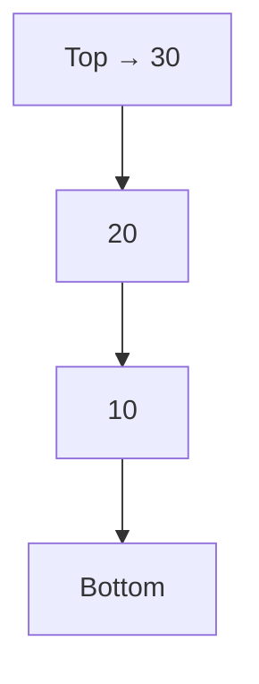
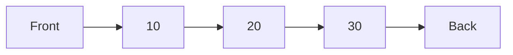
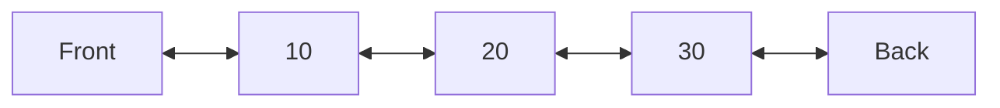
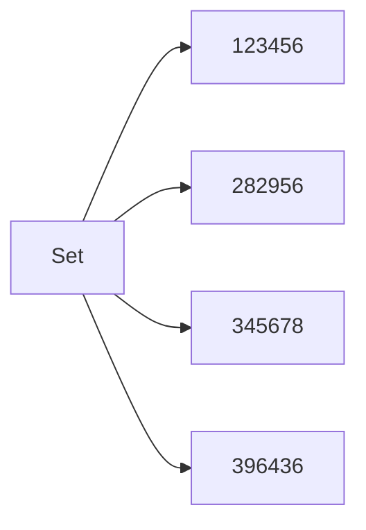
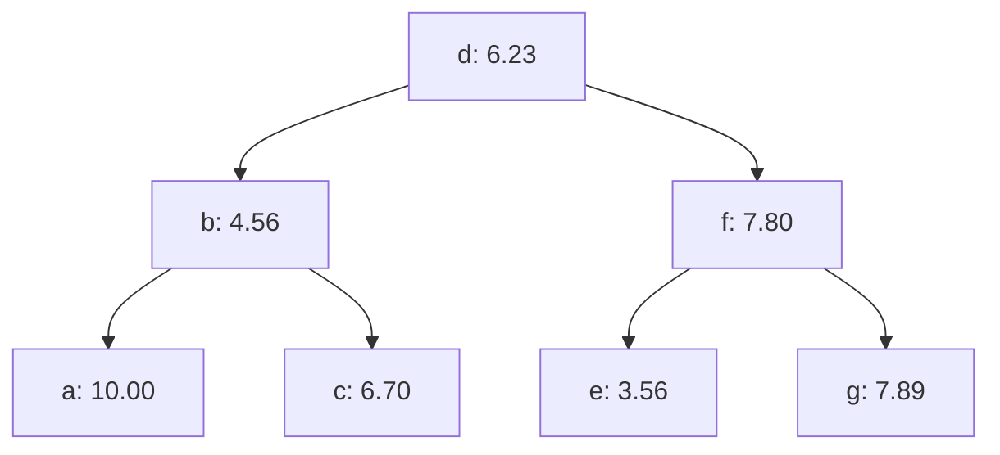
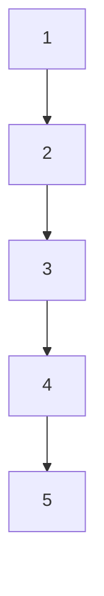
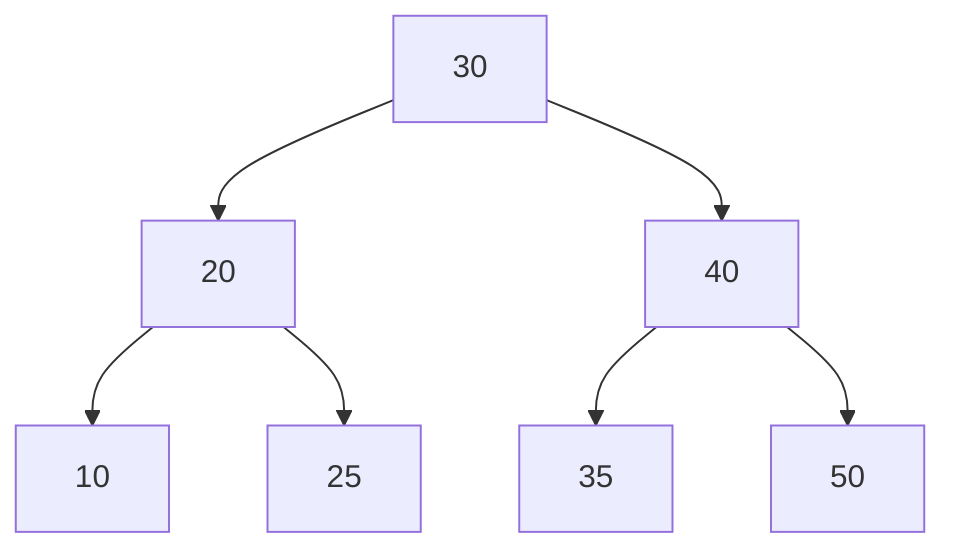
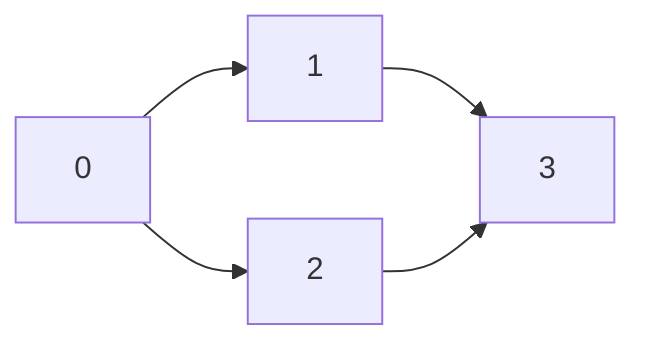
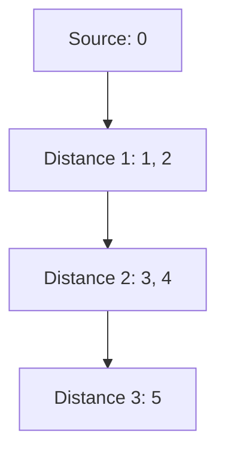
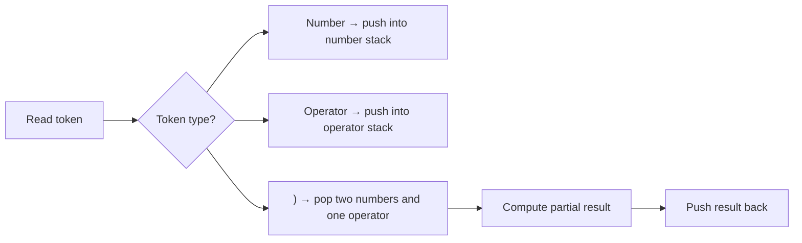

# 🧱 Data Structures Collection

A small educational collection of classic **data structures** implemented in **C, C++, and Python**.

This project contains stack, queue, deque, set, tree, and graph implementations, along with example programs that demonstrate how these structures can be used in practical computational problems such as expression evaluation, BFS traversal, topological sorting, and binary search tree removal.

---

## 🧠 Project Overview

This repository is focused on the implementation and study of fundamental data structures.

The main goal is to show how each structure works internally, without relying only on standard library containers such as `std::stack`, `std::queue`, `std::set`, `std::map`, or Python built-in abstractions.

The project includes:

```text
Stacks
Queues
Deques
Sets
Trees
Graphs
Expression evaluators
Algorithm demonstrations
```

Each structure was written with educational clarity in mind, using explicit memory management, clear function names, and comments explaining the role of each operation.

---

## 🧰 Dependencies & Tools

[]()
[]()
[]()
[]()
[]()

---

## ✅ Main Usage per Folder

| Folder      | Description                                                                                             |
| ----------- | ------------------------------------------------------------------------------------------------------- |
| `stacks/`   | Stack implementations using arrays, linked nodes, fixed capacity, dynamic resizing, C, C++, and Python. |
| `queues/`   | Queue implementations using circular arrays and linked nodes.                                           |
| `deques/`   | Double-ended queue implementations, allowing insertion and removal from both ends.                      |
| `sets/`     | Set implementations using linked lists and ordered dynamic arrays.                                      |
| `trees/`    | Binary search tree and AVL dictionary implementations.                                                  |
| `graphs/`   | Graph implementation using adjacency lists.                                                             |
| `examples/` | Executable programs that demonstrate how the data structures are used.                                  |
| `utils/`    | Auxiliary helper files used by examples or C implementations.                                           |

---

## 📂 Repository Structure

The project is organized by data structure category. Reusable implementations are separated from example programs.

```text
data_structures/
│
├── stacks/
│   ├── fixed_capacity_stack.hpp
│   ├── fixed_capacity_stack.py
│   ├── fixed_long_double_stack.h
│   ├── linked_stack.hpp
│   └── resizable_stack.hpp
│
├── queues/
│   ├── fixed_circular_queue.hpp
│   └── linked_queue.hpp
│
├── deques/
│   ├── bounded_deque.hpp
│   └── linked_deque.hpp
│
├── sets/
│   ├── doubly_linked_set.hpp
│   ├── ordered_dynamic_set.hpp
│   └── singly_linked_set.hpp
│
├── trees/
│   ├── avl_dictionary.cpp
│   ├── avl_dictionary_with_removal.cpp
│   └── bst_dictionary.hpp
│
├── graphs/
│   └── adjacency_list_graph.hpp
│
├── examples/
│   ├── arithmetic_expression_evaluator.cpp
│   ├── bst_dictionary_removal_demo.cpp
│   ├── fixed_stack_demo.cpp
│   ├── graph_bfs_distances.cpp
│   ├── ordered_student_set_demo.cpp
│   ├── parenthesized_calculator.c
│   ├── parenthesized_expression_evaluator.py
│   └── topological_sort.cpp
│
├── utils/
│   └── decimal_splitter.h
│
└── README.md
```

---

## 🧱 File Organization Logic

The repository separates **reusable structures** from **example programs**.

Files such as:

```text
fixed_capacity_stack.hpp
linked_queue.hpp
bst_dictionary.hpp
adjacency_list_graph.hpp
```

are reusable data structure implementations.

Files such as:

```text
fixed_stack_demo.cpp
graph_bfs_distances.cpp
topological_sort.cpp
ordered_student_set_demo.cpp
```

are example programs that use those structures to solve small computational problems.

---

## 📘 Main Usage per File

### Stacks

| File                        | Description                                                |
| --------------------------- | ---------------------------------------------------------- |
| `fixed_capacity_stack.hpp`  | Fixed-capacity C++ stack implemented with a dynamic array. |
| `fixed_capacity_stack.py`   | Python fixed-capacity stack.                               |
| `fixed_long_double_stack.h` | C fixed-capacity stack specialized for `long double`.      |
| `linked_stack.hpp`          | C++ linked stack implemented with nodes.                   |
| `resizable_stack.hpp`       | C++ stack that grows automatically when full.              |

### Queues

| File                       | Description                                  |
| -------------------------- | -------------------------------------------- |
| `fixed_circular_queue.hpp` | Fixed-capacity circular queue.               |
| `linked_queue.hpp`         | Linked queue with dynamic memory allocation. |

### Deques

| File                | Description                                  |
| ------------------- | -------------------------------------------- |
| `bounded_deque.hpp` | Fixed-capacity deque.                        |
| `linked_deque.hpp`  | Linked deque with dynamic memory allocation. |

### Sets

| File                      | Description                                                  |
| ------------------------- | ------------------------------------------------------------ |
| `singly_linked_set.hpp`   | Set implemented with a singly linked list.                   |
| `doubly_linked_set.hpp`   | Set implemented with a doubly linked list and sentinel node. |
| `ordered_dynamic_set.hpp` | Ordered dynamic set using an array and binary search.        |

### Trees

| File                              | Description                                       |
| --------------------------------- | ------------------------------------------------- |
| `bst_dictionary.hpp`              | Dictionary implemented with a binary search tree. |
| `avl_dictionary.cpp`              | AVL dictionary implementation.                    |
| `avl_dictionary_with_removal.cpp` | AVL dictionary with removal-related logic.        |

### Graphs

| File                       | Description                                 |
| -------------------------- | ------------------------------------------- |
| `adjacency_list_graph.hpp` | Graph implementation using adjacency lists. |

### Examples

| File                                    | Description                                                          |
| --------------------------------------- | -------------------------------------------------------------------- |
| `fixed_stack_demo.cpp`                  | Demonstrates stack operations with integers and doubles.             |
| `arithmetic_expression_evaluator.cpp`   | Evaluates fully parenthesized arithmetic expressions using stacks.   |
| `parenthesized_calculator.c`            | C version of a parenthesized expression calculator.                  |
| `parenthesized_expression_evaluator.py` | Python version of a parenthesized expression evaluator.              |
| `ordered_student_set_demo.cpp`          | Demonstrates an ordered set storing students by registration number. |
| `bst_dictionary_removal_demo.cpp`       | Demonstrates insertion, traversal, and removal in a BST dictionary.  |
| `graph_bfs_distances.cpp`               | Computes distances in a graph using BFS.                             |
| `topological_sort.cpp`                  | Performs topological sorting in a directed graph.                    |

---

# 🧠 Data Structures Overview

This project contains classic data structures implemented mainly for educational purposes. The goal is to understand how stacks, queues, deques, sets, trees, and graphs work internally, including memory organization, insertion/removal behavior, and algorithmic complexity.

---

## 📚 Stack

A **stack** follows the **LIFO** rule:

```text
Last In, First Out
```

The last element inserted is the first one removed.



In this repository, stacks appear in different forms:

| File                        | Type                                     |
| --------------------------- | ---------------------------------------- |
| `fixed_capacity_stack.hpp`  | Fixed-capacity C++ stack                 |
| `fixed_capacity_stack.py`   | Fixed-capacity Python stack              |
| `fixed_long_double_stack.h` | Fixed-capacity C stack for `long double` |
| `linked_stack.hpp`          | Linked stack                             |
| `resizable_stack.hpp`       | Dynamically growing stack                |

### Stack Complexity

| Operation  | Fixed Array Stack | Resizable Stack | Linked Stack |
| ---------- | ----------------: | --------------: | -----------: |
| `push`     |              O(1) |  O(1) amortized |         O(1) |
| `pop`      |              O(1) |            O(1) |         O(1) |
| `top`      |              O(1) |            O(1) |         O(1) |
| `is_empty` |              O(1) |            O(1) |         O(1) |
| Space      |              O(n) |            O(n) |         O(n) |

The **resizable stack** may occasionally need O(n) time when it reallocates the internal array, but over many operations the average cost of `push` remains O(1) amortized.

---

## 🚶 Queue

A **queue** follows the **FIFO** rule:

```text
First In, First Out
```

The first element inserted is the first one removed.



In this repository:

| File                       | Type                 |
| -------------------------- | -------------------- |
| `fixed_circular_queue.hpp` | Circular array queue |
| `linked_queue.hpp`         | Linked queue         |

### Queue Complexity

| Operation | Circular Queue | Linked Queue |
| --------- | -------------: | -----------: |
| `enqueue` |           O(1) |         O(1) |
| `dequeue` |           O(1) |         O(1) |
| `front`   |           O(1) |         O(1) |
| `back`    |           O(1) |         O(1) |
| Space     |           O(n) |         O(n) |

The circular queue is more memory-local and efficient, while the linked queue grows dynamically while memory is available.

---

## 🔁 Deque

A **deque**, or double-ended queue, allows insertion and removal from both ends.



In this repository:

| File                | Type                 |
| ------------------- | -------------------- |
| `bounded_deque.hpp` | Fixed-capacity deque |
| `linked_deque.hpp`  | Linked deque         |

### Deque Complexity

| Operation    | Bounded Deque | Linked Deque |
| ------------ | ------------: | -----------: |
| `push_front` |          O(1) |         O(1) |
| `push_back`  |          O(1) |         O(1) |
| `pop_front`  |          O(1) |         O(1) |
| `pop_back`   |          O(1) |         O(1) |
| `front`      |          O(1) |         O(1) |
| `back`       |          O(1) |         O(1) |
| Space        |          O(n) |         O(n) |

A deque is useful when elements must be processed from both ends, such as in sliding-window algorithms, undo/redo systems, and task scheduling.

---

## 🧩 Sets

A **set** stores unique elements. The main idea is that repeated values or repeated keys should not be inserted.



In this repository:

| File                      | Type                                              |
| ------------------------- | ------------------------------------------------- |
| `singly_linked_set.hpp`   | Set using singly linked list                      |
| `doubly_linked_set.hpp`   | Set using doubly linked list                      |
| `ordered_dynamic_set.hpp` | Ordered set using dynamic array and binary search |

### Set Complexity

| Operation | Singly Linked Set | Doubly Linked Set | Ordered Dynamic Set |
| --------- | ----------------: | ----------------: | ------------------: |
| Search    |              O(n) |              O(n) |            O(log n) |
| Insert    |              O(n) |              O(n) |                O(n) |
| Remove    |              O(n) |              O(n) |                O(n) |
| Space     |              O(n) |              O(n) |                O(n) |

The **ordered dynamic set** has faster search because it uses binary search. However, insertion and removal still cost O(n) because elements may need to be shifted inside the array.

---

## 🌳 Binary Search Tree Dictionary

A **binary search tree**, or BST, stores keys following this rule:

```text
left key < current key < right key
```



In this repository:

| File                              | Type                                       |
| --------------------------------- | ------------------------------------------ |
| `bst_dictionary.hpp`              | Dictionary using binary search tree        |
| `bst_dictionary_removal_demo.cpp` | Demo for insertion, traversal, and removal |

### BST Complexity

| Operation | Average Case | Worst Case |
| --------- | -----------: | ---------: |
| Search    |     O(log n) |       O(n) |
| Insert    |     O(log n) |       O(n) |
| Remove    |     O(log n) |       O(n) |
| Traversal |         O(n) |       O(n) |
| Space     |         O(n) |       O(n) |

The worst case happens when the tree becomes unbalanced, almost like a linked list.

Example:



In this case, searching becomes O(n).

---

## 🌲 AVL Dictionary

An **AVL tree** is a self-balancing binary search tree. It keeps the height difference between left and right subtrees controlled.



In this repository:

| File                              | Type                              |
| --------------------------------- | --------------------------------- |
| `avl_dictionary.cpp`              | AVL dictionary logic              |
| `avl_dictionary_with_removal.cpp` | AVL dictionary with removal logic |

### AVL Complexity

| Operation |     Time |
| --------- | -------: |
| Search    | O(log n) |
| Insert    | O(log n) |
| Remove    | O(log n) |
| Rotation  |     O(1) |
| Traversal |     O(n) |
| Space     |     O(n) |

AVL trees are stricter than regular BSTs. They spend extra work rotating nodes during insertion and removal, but in exchange they keep search efficient.

---

## 🕸️ Graph

A **graph** stores relationships between vertices.

In this project, the graph is represented using an **adjacency list**.



In this repository:

| File                       | Type                        |
| -------------------------- | --------------------------- |
| `adjacency_list_graph.hpp` | Graph using adjacency lists |
| `graph_bfs_distances.cpp`  | BFS distance example        |
| `topological_sort.cpp`     | Topological sorting example |

### Graph Representation Complexity

| Representation   |    Space |   Check Edge | Iterate Neighbors |
| ---------------- | -------: | -----------: | ----------------: |
| Adjacency List   | O(V + E) | O(degree(v)) |      O(degree(v)) |
| Adjacency Matrix |    O(V²) |         O(1) |              O(V) |

The reusable graph structure uses **adjacency lists**, which are usually better when the graph is sparse.

---

## 🔎 Breadth-First Search

**BFS** visits vertices level by level using a queue.



### BFS Complexity

| Operation                  | Complexity |
| -------------------------- | ---------: |
| Time with adjacency list   |   O(V + E) |
| Time with adjacency matrix |      O(V²) |
| Space                      |       O(V) |

BFS is useful for finding the shortest number of edges between a source vertex and all reachable vertices in an unweighted graph.

---

## 📌 Topological Sort

Topological sorting orders vertices of a directed acyclic graph so that every dependency appears before the element that depends on it.


One valid topological order is:

```text
0 → 1 → 2 → 3
```

### Topological Sort Complexity

| Operation | Complexity |
| --------- | ---------: |
| Time      |   O(V + E) |
| Space     |       O(V) |

Topological sorting is useful for:

```text
task scheduling
dependency resolution
course prerequisites
build systems
```

---

## 🧮 Expression Evaluators

The expression evaluators use stacks to compute fully parenthesized arithmetic expressions.

Example:

```text
((2+3)*(4-1))
```

The logic uses:

```text
one stack for numbers
one stack for operators
```



### Expression Evaluator Complexity

| Operation    | Complexity |
| ------------ | ---------: |
| Tokenization |       O(n) |
| Evaluation   |       O(n) |
| Space        |       O(n) |

Where `n` is the number of characters or tokens in the expression.

---

## 📊 General Complexity Summary

| Structure            |                    Search |                    Insert |                    Remove | Access Top/Front |    Space |
| -------------------- | ------------------------: | ------------------------: | ------------------------: | ---------------: | -------: |
| Stack                |          O(n) if searched |                      O(1) |                      O(1) |             O(1) |     O(n) |
| Queue                |          O(n) if searched |                      O(1) |                      O(1) |             O(1) |     O(n) |
| Deque                |          O(n) if searched |              O(1) at ends |              O(1) at ends |             O(1) |     O(n) |
| Linked Set           |                      O(n) |                      O(n) |                      O(n) |                — |     O(n) |
| Ordered Dynamic Set  |                  O(log n) |                      O(n) |                      O(n) |    O(1) by index |     O(n) |
| BST Dictionary       | O(log n) avg / O(n) worst | O(log n) avg / O(n) worst | O(log n) avg / O(n) worst |                — |     O(n) |
| AVL Dictionary       |                  O(log n) |                  O(log n) |                  O(log n) |                — |     O(n) |
| Graph Adjacency List |        O(V + E) traversal |       O(1) edge insertion | O(degree(v)) edge removal |                — | O(V + E) |

---

## ▶️ How to Compile C++ Examples

From the `data_structures/` folder, examples can be compiled with `g++`.

Example:

```bash
g++ -std=c++17 examples/fixed_stack_demo.cpp -I stacks -o fixed_stack_demo
```

Then run:

```bash
./fixed_stack_demo
```

On Windows PowerShell:

```bash
.\fixed_stack_demo.exe
```

Another example:

```bash
g++ -std=c++17 examples/topological_sort.cpp -I graphs -I queues -o topological_sort
```

Then run:

```bash
./topological_sort
```

On Windows PowerShell:

```bash
.\topological_sort.exe
```

---

## ▶️ How to Compile C Examples

Example:

```bash
gcc examples/parenthesized_calculator.c -I stacks -o parenthesized_calculator
```

Then run:

```bash
./parenthesized_calculator
```

On Windows PowerShell:

```bash
.\parenthesized_calculator.exe
```

---

## ▶️ How to Run Python Examples

Example:

```bash
python examples/parenthesized_expression_evaluator.py
```

On Windows, you can also use:

```bash
py examples/parenthesized_expression_evaluator.py
```

---

## 🧪 Behavior Summary

This repository demonstrates how fundamental structures behave internally.

```text
1. Stacks insert and remove elements from the top.
2. Queues insert at the back and remove from the front.
3. Deques allow insertion and removal from both ends.
4. Sets store unique elements.
5. Ordered sets keep elements sorted by key.
6. BST dictionaries store key-value pairs in a binary search tree.
7. AVL dictionaries keep the tree balanced.
8. Graphs represent relationships between vertices.
9. BFS uses a queue to visit vertices by distance.
10. Topological sorting orders directed dependencies.
11. Expression evaluators use stacks to compute arithmetic expressions.
```

---

## 🧱 Current Architecture

The project separates reusable structures from demonstration programs.

### Reusable Structures

Reusable data structures are stored in folders such as:

```text
stacks/
queues/
deques/
sets/
trees/
graphs/
```

These files are intended to be included and reused by other programs.

### Example Programs

The `examples/` folder contains executable programs that demonstrate how the structures work in practice.

These examples are useful for testing, learning, and showing computational applications.

---

## 🧭 Future Improvements

Possible improvements include:

* Add unit tests for each structure.
* Add CMake support.
* Add Makefiles for C and C++ examples.
* Add examples for DFS.
* Add Dijkstra's algorithm.
* Add AVL tree header-only version.
* Add red-black tree implementation.
* Add hash table implementation.
* Add heap and priority queue.
* Add comments comparing time complexity inside each source file.
* Add diagrams for stacks, queues, trees, and graphs.
* Add automated GitHub Actions builds.
* Separate C, C++, and Python examples into language-specific folders.
* Add memory leak checks with tools such as Valgrind.
* Add benchmark examples comparing different implementations.

---

## ⚠️ Notes

This project is educational.

The goal is not to replace the C++ Standard Library or Python built-in structures. The goal is to understand how common data structures work internally.

For production C++ code, prefer standard library containers when possible:

```text
std::vector
std::stack
std::queue
std::deque
std::set
std::map
std::unordered_map
```

For learning, implementing these structures manually is valuable because it shows:

```text
manual memory management
pointers
linked nodes
dynamic arrays
binary search
tree traversal
graph representation
algorithmic thinking
algorithmic complexity
```

---

## 📄 License

This project is available for educational and study purposes.

If a license file is added to the repository, refer to `LICENSE` for usage terms.
