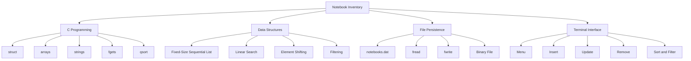
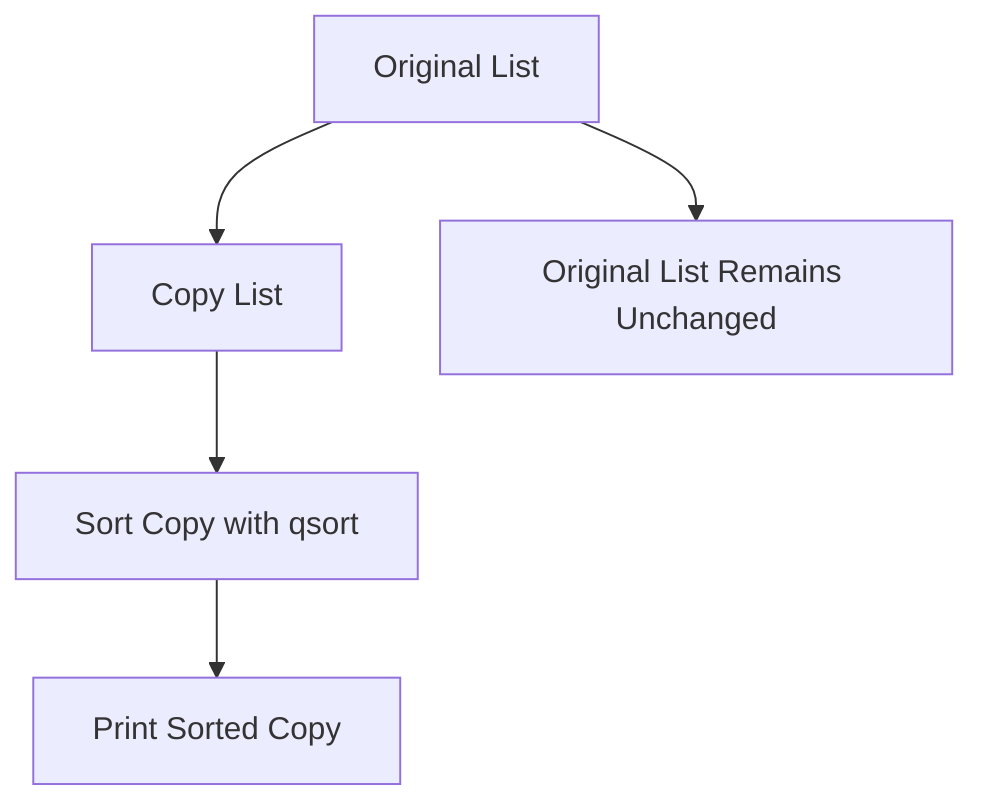

# 💻 Notebook Inventory

<p>
  
  
  
  
  
  
</p>

A simple **C-based inventory management system** for storing, updating, removing, sorting, filtering, loading, and saving notebooks in stock.

This project was developed as a basic **data structures**, **file handling**, and **modular C programming** exercise. It uses `struct`, fixed-size arrays, binary file persistence, safe input handling with `fgets()`, sorting with `qsort()`, and modular organization through a header file.

The system allows the user to manage a notebook inventory directly from the terminal.

---

## 📌 Overview

The application manages a list of notebooks with information such as:

- Brand
- Model
- Processor
- Storage capacity
- RAM capacity
- Screen size
- Input/output information
- Operating system
- Price
- Automatically generated notebook code

Each notebook receives a unique code based on its main identifying fields. This code is used to search, update, and remove notebooks from the inventory.

The inventory is stored in a fixed-size array inside a `NotebookList` structure. The current maximum capacity is defined by:

```c
#define MAX 100
```

This means the inventory can store up to 100 notebooks.

The goal of the project is not to build a production-ready inventory system. The goal is to understand how records, arrays, file persistence, searching, sorting, and modular C code work internally.

---

## 🖼️ Illustrative Images

### C Programming Language


Image source: [Wikimedia Commons — C Programming Language.svg](https://commons.wikimedia.org/wiki/File:C_Programming_Language.svg)

---

### Notebook / Laptop Inventory


Image source: [Wikimedia Commons — Laptop Pinhead icon.svg](https://commons.wikimedia.org/wiki/File:Laptop_Pinhead_icon.svg)

---

### Binary Persistence / Database Representation


Image source: [Wikimedia Commons — Database-icon.svg](https://commons.wikimedia.org/wiki/File:Database-icon.svg)

---

## 🧭 Conceptual Map



---

## ✅ Main Usage per File

| File | Description |
|---|---|
| `main.c` | Main application file. Handles the menu, user interaction, file loading, file saving, sorting, filtering, update confirmation, and removal confirmation. |
| `notebook.h` | Contains the notebook data structures and functions used to manipulate the inventory. |
| `notebooks.dat` | Binary data file used to persist the notebook inventory between program executions. |
| `README.md` | Project documentation. |

---

## 📂 Repository Structure

```text
Notebook Inventory/
│
├── main.c
├── notebook.h
├── notebooks.dat
└── README.md
```

---

## 🧾 Features

The terminal menu provides the following options:

| Option | Action |
|---:|---|
| `1` | Insert a new notebook |
| `2` | Remove a notebook |
| `3` | Update notebook data |
| `4` | Show notebook list sorted by price |
| `5` | Show notebook list sorted by brand |
| `6` | Show notebook list sorted by processor |
| `7` | Show notebook list filtered by brand |
| `8` | Show notebook list filtered by processor |
| `0` | Exit the application |

---

## 📘 Computational Concepts

This project demonstrates important foundational concepts in C programming.

---

### 🧱 Structs

The notebook information is stored using a `struct`, which groups related data into a single record.

```c
struct Notebook {
    char brand[TEXT_SIZE];
    char model[TEXT_SIZE];
    char processor[TEXT_SIZE];
    int storage;
    int ram;
    double screenSize;
    char inputOutput[TEXT_SIZE];
    char operatingSystem[TEXT_SIZE];
    int price;
    char code[CODE_SIZE];
};
```

The inventory itself is represented by another structure:

```c
struct NotebookList {
    unsigned count;
    struct Notebook items[MAX];
};
```

This structure stores a fixed-size array of notebooks and keeps track of the number of registered items.

Conceptually, the inventory works like this:

```text
NotebookList
│
├── count: number of registered notebooks
│
└── items[MAX]
    ├── items[0]  → Notebook
    ├── items[1]  → Notebook
    ├── items[2]  → Notebook
    ├── ...
    └── items[99] → Notebook
```

---

### 🧾 Fixed-Size Sequential List

The inventory uses a fixed-size array:

```c
struct Notebook items[MAX];
```

This makes insertion at the end simple and efficient, but searching, filtering, and removing require scanning the array.

Advantages:

- Simple memory layout
- No dynamic allocation required for the list
- Easy binary file saving with `fwrite()`
- Predictable memory usage
- Good for small educational systems

Limitations:

- Maximum capacity is fixed
- Searching is linear
- Removing an item requires shifting later elements to the left
- Large inventories would need a more scalable structure

---

### 🗃️ Binary File Persistence

The inventory is saved in a binary file:

```text
notebooks.dat
```

The program uses `fread()` and `fwrite()` to load and save the full notebook list.

```c
fread(notebookList, sizeof(struct NotebookList), 1, file);
```

```c
fwrite(notebookList, sizeof(struct NotebookList), 1, file);
```

Because the `.dat` file is binary, it should not be edited manually in a text editor.

The file is automatically loaded when the program starts and can be saved when the user exits the application.

A simplified persistence flow:


---

### 🔎 Search Operations

The application supports searching notebooks by:

- Notebook code
- Brand
- Processor

The notebook code is the main identifier used to update and remove records.

Search is performed with a linear scan:

```text
Start at items[0]
Check each notebook
Stop when the target is found
Return -1 if the target does not exist
```

The search cost grows linearly with the number of registered notebooks:

$$
T(n) = O(n)
$$

---

### 🔃 Sorting with `qsort()`

The project uses the standard C function `qsort()` to sort notebooks by:

- Price
- Brand
- Processor

Example:

```c
qsort(sortedList.items,
      sortedList.count,
      sizeof(struct Notebook),
      compareByPrice);
```

The program sorts a copy of the list, not the original inventory. This means the stored order remains unchanged.

Sorting flow:



In typical comparison-based sorting, the expected cost is:

$$
O(n \log n)
$$

The exact behavior depends on the standard library implementation of `qsort()`.

---

### 🧼 Safe Input Handling

The program avoids unsafe input functions such as `gets()`.

Instead, it uses `fgets()` and helper functions to read text safely:

```c
fgets(buffer, bufferSize, stdin);
```

The code also removes trailing newline characters and discards extra input when needed.

This improves safety and reduces the risk of buffer overflow.

---

## 🧮 Data Model

### Notebook Record

Each notebook is represented as one record:

```text
Notebook
├── brand
├── model
├── processor
├── storage
├── ram
├── screenSize
├── inputOutput
├── operatingSystem
├── price
└── code
```

### Inventory List

The full inventory is a sequential list:

```text
NotebookList
├── count
└── items[MAX]
```

The current capacity is:

$$
MAX = 100
$$

The current number of registered notebooks is:

$$
0 \leq n \leq MAX
$$

---

## 🔐 Notebook Code

Each notebook receives an automatically generated code based on its identifying fields.

Conceptually:

$$
code = f(brand, model, processor, storage, ram)
$$

This generated code is used as the main key for:

- Finding a notebook
- Updating a notebook
- Removing a notebook
- Avoiding duplicate records

Because the code is generated from notebook attributes, changes to those attributes may require regenerating and validating the code.

---

## ⏱️ Time and Space Complexity

Let:

```text
n = current number of notebooks in the inventory
MAX = maximum inventory capacity, currently 100
k = maximum string/code length
```

Since the project uses fixed-size strings such as `TEXT_SIZE` and `CODE_SIZE`, string comparisons are bounded by small constants in practice.

For theoretical analysis, string comparisons may be considered $O(k)$.

---

### Operation Complexity Summary

| Operation | Time Complexity | Extra Space Complexity | Explanation |
|---|---:|---:|---|
| Initialize list | $O(1)$ | $O(1)$ | Only sets `count` to zero. |
| Insert notebook directly | $O(1)$ | $O(1)$ | Adds the notebook at the end of the array. |
| Add new notebook | $O(n)$ | $O(1)$ | Generates code and checks if the generated code already exists. |
| Find by code | $O(n)$ | $O(1)$ | Scans the array until the code is found or the list ends. |
| Find by brand | $O(n)$ | $O(1)$ | Scans the array until the first matching brand is found. |
| Find by processor | $O(n)$ | $O(1)$ | Scans the array until the first matching processor is found. |
| Print all notebooks | $O(n)$ | $O(1)$ | Prints every registered notebook. |
| Filter by brand | $O(n)$ | $O(1)$ | Scans the list to print matching records. |
| Filter by processor | $O(n)$ | $O(1)$ | Scans the list to print matching records. |
| Remove notebook | $O(n)$ | $O(1)$ | Finds the notebook and shifts later elements one position left. |
| Update notebook | $O(n)$ | $O(1)$ | Finds the notebook and may check for duplicate generated codes. |
| Sort by price | Usually $O(n \log n)$ | $O(n)$ | Copies the list and sorts the copy with `qsort()`. |
| Sort by brand | Usually $O(n \log n)$ | $O(n)$ | Copies the list and sorts the copy with `qsort()`. |
| Sort by processor | Usually $O(n \log n)$ | $O(n)$ | Copies the list and sorts the copy with `qsort()`. |
| Load inventory from file | $O(MAX)$ | $O(1)$ | Reads the full `NotebookList` structure from the binary file. |
| Save inventory to file | $O(MAX)$ | $O(1)$ | Writes the full `NotebookList` structure to the binary file. |

---

### Important Complexity Notes

Although the list currently supports up to 100 notebooks, the theoretical complexity is still useful for understanding the algorithmic behavior.

Removing a notebook is $O(n)$ because after finding the notebook, the program must shift the remaining elements:

```text
Before removal:

[ A ][ B ][ C ][ D ][ E ]
            ^
         remove C

After shifting:

[ A ][ B ][ D ][ E ]
```

Sorting uses an additional copy of the list:

```text
Original list: unchanged
Sorted copy:   used only for printing
```

Therefore, sorting requires $O(n)$ extra space.

---

## 🧮 Data Structure Analysis

The core data structure of this project is a fixed-size sequential list.

```text
items[MAX]
│
├── Fast insertion at the end: O(1)
├── Linear search: O(n)
├── Linear removal: O(n)
└── Fixed maximum capacity: O(MAX)
```

This is a good educational structure because it is simple, direct, and easy to inspect in memory.

However, if the inventory became much larger, other structures could be considered:

| Alternative Structure | Advantage | Trade-off |
|---|---|---|
| Sorted array | Faster binary search | More expensive insertion and removal |
| Linked list | Easier removal after finding the node | Still linear search and worse cache locality |
| Hash table | Faster average search by code | More complex implementation |
| Binary search tree | Ordered search and traversal | Requires tree balancing for reliable performance |
| Database | Persistent querying and indexing | Requires external database system |

---

## ▶️ How to Run

### 🔧 Requirements

You need a C compiler installed.

On Windows, one recommended option is **MSYS2 UCRT64** with GCC.

To check if GCC is available, run:

```bash
gcc --version
```

If GCC is correctly installed, the terminal should display the compiler version.

---

## 🚀 Compiling the Program

Open the terminal inside the project folder:

```bash
cd "Notebook Inventory"
```

Compile the main application:

```bash
gcc main.c -o notebook_inventory.exe
```

Or, with extra compiler warnings:

```bash
gcc -Wall -Wextra main.c -o notebook_inventory.exe
```

If you later split the project into `main.c`, `notebook.c`, and `notebook.h`, the command may become:

```bash
gcc -Wall -Wextra main.c notebook.c -o notebook_inventory.exe
```

---

## ▶️ Running the Program

On MSYS2 UCRT64, Linux, or macOS-like terminals:

```bash
./notebook_inventory.exe
```

On PowerShell:

```powershell
.\notebook_inventory.exe
```

On CMD:

```cmd
notebook_inventory.exe
```

---

## 💾 Data File

The program uses the following file to store the inventory:

```text
notebooks.dat
```

This file is automatically read when the program starts and can be updated when the user chooses to save changes before exiting.

Important:

> `notebooks.dat` is a binary file. Do not manually edit it as plain text.

If the structure definitions in `notebook.h` change, the old `.dat` file may become incompatible. In that case, delete the old file and let the program create a new one.

---

## 🧪 Example Workflow

Compile the program:

```bash
gcc main.c -o notebook_inventory.exe
```

Run it:

```bash
./notebook_inventory.exe
```

Choose an option from the menu:

```text
**********************
* Notebook Inventory *
**********************

  1 - INSERT notebook
  2 - REMOVE notebook
  3 - UPDATE notebook data
  4 - SHOW notebook list sorted by PRICE
  5 - SHOW notebook list sorted by BRAND
  6 - SHOW notebook list sorted by PROCESSOR
  7 - SHOW notebook list filtered by BRAND
  8 - SHOW notebook list filtered by PROCESSOR
  0 - EXIT application

  Choose an option:
```

Example workflow:

```text
1. Choose option 1 to insert a notebook.
2. Fill in brand, model, processor, storage, RAM, screen size, input/output, operating system, and price.
3. The program automatically generates a notebook code.
4. Choose option 4, 5, or 6 to print sorted lists.
5. Choose option 7 or 8 to filter notebooks.
6. Choose option 2 to remove a notebook by code.
7. Choose option 3 to update a notebook by code.
8. Choose option 0 to exit.
9. If the inventory changed, the program asks whether the changes should be saved.
```

---

## 🧰 Technologies and Tools

| Tool / Language | Purpose |
|---|---|
| C | Main programming language |
| GCC | Compilation |
| MSYS2 / UCRT64 | Windows development environment |
| `struct` | Record modeling |
| Fixed-size arrays | Sequential inventory storage |
| `fgets()` | Safer text input |
| `qsort()` | Sorting with custom comparators |
| `fread()` / `fwrite()` | Binary file persistence |
| Terminal / Console | User interface |

---

## 🧠 Educational Notes

This project is intentionally simple.

Some design decisions are not ideal for production, but they make the internal logic easier to understand.

Examples:

- Fixed-size array instead of dynamic memory allocation
- Binary `.dat` file instead of a database
- Linear search instead of a hash table
- Terminal menu instead of graphical interface
- Direct `struct` serialization instead of portable file formats such as CSV, JSON, or SQLite

These decisions make the project useful for learning the foundations of C programming and basic data structure manipulation.

---

## 🧭 Future Improvements

Possible improvements include:

- Add search by price range
- Add search by RAM amount
- Add search by storage capacity
- Add case-insensitive filtering by brand and processor
- Add support for partial text search
- Add CSV export
- Add CSV import
- Add dynamic memory allocation instead of fixed `MAX`
- Add a hash table for faster search by notebook code
- Add automatic save after each change
- Add unit tests for the inventory functions
- Split implementation into `notebook.c` and `notebook.h`
- Add a `Makefile`
- Add a CMake configuration
- Add input validation for negative prices, RAM, and storage values
- Add date of registration for each notebook
- Add stock quantity for repeated notebook models
- Add sorting in ascending and descending order
- Add persistent versioning for the binary file format
- Add a safer portable storage format such as CSV, JSON, or SQLite

---

## ⚠️ Notes

- This project uses a fixed maximum inventory size defined by `MAX`.
- The `.dat` file depends on the exact structure layout used in the code.
- If the struct fields are changed, old binary files may no longer be valid.
- The program is intended for educational purposes and demonstrates basic data structure manipulation in C.
- The sorting options sort a copy of the list, not the original stored inventory.
- The search operations are linear because the inventory is stored in a simple array.
- The binary file is practical for this exercise, but for larger systems a database or structured text format may be more appropriate.

---

## 🖼️ Image Credits and Licenses

| Image | Author / Source | License | Link |
|---|---|---|---|
| C Programming Language Logo | ElodinKaldwin / Wikimedia Commons | Public domain / trademark note | [File page](https://commons.wikimedia.org/wiki/File:C_Programming_Language.svg) |
| Laptop Pinhead Icon | OSM Carto contributors / Wikimedia Commons | CC0 1.0 | [File page](https://commons.wikimedia.org/wiki/File:Laptop_Pinhead_icon.svg) |
| Database Icon | Zahra Ibrahem / Wikimedia Commons | CC BY-SA 4.0 | [File page](https://commons.wikimedia.org/wiki/File:Database-icon.svg) |

---

## 📚 References and Further Reading

The following books and online resources are useful for studying C programming, data structures, file handling, sorting, and algorithmic complexity.

### Books

| Reference | Main Topic | Why it is useful | Link |
|---|---|---|---|
| Brian W. Kernighan and Dennis M. Ritchie — *The C Programming Language* | C programming | Classic reference for C syntax, pointers, arrays, strings, functions, and file handling. | [Pearson](https://www.pearson.com/en-us/subject-catalog/p/c-programming-language/P200000003181) |
| K. N. King — *C Programming: A Modern Approach* | C programming | Strong introductory and intermediate C book with clear explanations and exercises. | [W. W. Norton](https://wwnorton.com/books/9780393979503) |
| Mark Allen Weiss — *Data Structures and Algorithm Analysis in C* | Data structures in C | Useful for studying lists, stacks, queues, trees, hashing, sorting, and complexity analysis in C. | [Pearson](https://www.pearson.com/en-us/subject-catalog/p/data-structures-and-algorithm-analysis-in-c/P200000003389) |
| Robert Sedgewick — *Algorithms in C, Parts 1-4* | Algorithms in C | Covers fundamental algorithms and data structures with C implementations. | [Pearson](https://www.pearson.com/en-us/subject-catalog/p/algorithms-in-c-parts-1-4-fundamentals-data-structures-sorting-searching/P200000003428) |
| Thomas H. Cormen, Charles E. Leiserson, Ronald L. Rivest, Clifford Stein — *Introduction to Algorithms* | Algorithms | Comprehensive reference for algorithm analysis, sorting, searching, trees, hashing, and graph algorithms. | [MIT Press](https://mitpress.mit.edu/9780262046305/introduction-to-algorithms/) |
| Pat Morin — *Open Data Structures* | Data structures | Free textbook covering lists, queues, dictionaries, trees, hashing, graphs, and complexity analysis. | [Open Data Structures](https://opendatastructures.org/) |

---

### Online Resources

| Resource | Main Topic | Why it is useful | Link |
|---|---|---|---|
| GCC Documentation | C compilation | Official GCC documentation for compiling C programs. | [GCC Docs](https://gcc.gnu.org/onlinedocs/) |
| MSYS2 | Windows C toolchain | Useful Windows environment for GCC, Make, and Unix-like development tools. | [MSYS2](https://www.msys2.org/) |
| cppreference — C Reference | C language | Reference for C syntax, headers, standard library functions, memory handling, and file I/O. | [C Reference](https://en.cppreference.com/w/c) |
| cppreference — C `qsort()` | C sorting | Reference for the standard C `qsort()` function. | [qsort](https://en.cppreference.com/w/c/algorithm/qsort) |
| cppreference — C File I/O | C file handling | Reference for `fopen()`, `fread()`, `fwrite()`, `fclose()`, and related file operations. | [C File I/O](https://en.cppreference.com/w/c/io) |
| Open Data Structures | Data structures | Free book about data structures and complexity analysis. | [Open Data Structures](https://opendatastructures.org/) |
| CLRS — MIT Press | Algorithms | Official page for *Introduction to Algorithms*. | [MIT Press](https://mitpress.mit.edu/9780262046305/introduction-to-algorithms/) |
| GeeksforGeeks — Data Structures | Data structures | Large collection of examples and tutorials on data structures and algorithms. | [GeeksforGeeks DSA](https://www.geeksforgeeks.org/dsa/dsa-tutorial-learn-data-structures-and-algorithms/) |
| Programiz — C File Handling | C file handling | Beginner-friendly explanation of file handling in C. | [Programiz](https://www.programiz.com/c-programming/c-file-input-output) |

---

## 🧪 Suggested Study Path

A good study order for this project is:

```text
1. C structs
2. Fixed-size arrays
3. String handling in C
4. Safe input with fgets()
5. Linear search
6. Insertion in sequential lists
7. Removal with element shifting
8. Filtering with linear scans
9. Sorting with qsort()
10. Binary file persistence with fread() and fwrite()
11. Time and space complexity analysis
```

---

## 📄 License

This project is available for educational and study purposes.

If a license file is added to the repository, refer to `LICENSE` for usage terms.

---

## ✅ Summary

This project is a small but useful exercise in practical C programming.

It connects:

```text
structs
arrays
strings
terminal menus
linear search
sorting
binary files
safe input
complexity analysis
```

The main emphasis is:

```text
Model the data.
Store it in memory.
Search and modify records.
Persist the result.
Understand the cost of each operation.
```
