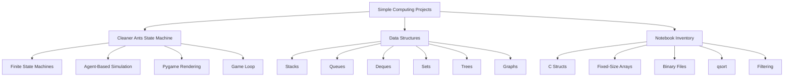
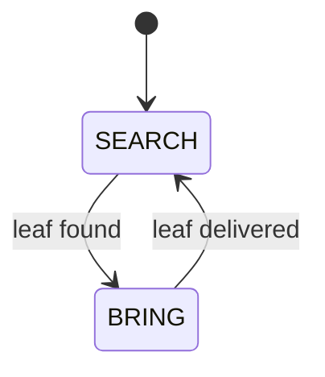
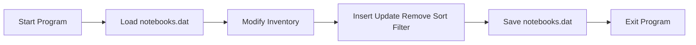

# 🧠 Simple Computing Projects

<p>
  
  
  
  
  
  
</p>

A collection of small educational computing projects focused on **data structures**, **C programming**, **C++ templates**, **Python simulations**, **finite state machines**, **file handling**, and **algorithmic thinking**.

This repository brings together practical implementations and demonstrations of fundamental computer science concepts using **C**, **C++**, and **Python**.

The main goal is not only to use ready-made libraries, but also to understand how core computational structures and behaviors work internally.

---

## 📌 Repository Overview

This repository currently contains three main projects:

| Project | Main Language | Description |
|---|---|---|
| [Cleaner Ants State Machine](./Cleaner%20Ants%20State%20Machine/) | Python | A Pygame-based multi-agent simulation using finite state machines. |
| [Data Structures](./Data%20Structures/) | C, C++, Python | A collection of classic data structures such as stacks, queues, deques, sets, trees, and graphs. |
| [Notebook Inventory](./Notebook%20Inventory/) | C | A terminal-based notebook inventory system using structs, arrays, binary files, sorting, and filtering. |

Each folder contains its own dedicated `README.md` with more detailed explanations, execution instructions, complexity analysis, and references.

---

## 🖼️ Illustrative Images

### Finite State Machine


Image source: [Wikimedia Commons — Finite State Machine diagram.jpg](https://commons.wikimedia.org/wiki/File:Finite_State_Machine_diagram.jpg)

---

### Queue Data Structure


Image source: [Wikimedia Commons — Data Queue.svg](https://commons.wikimedia.org/wiki/File:Data_Queue.svg)

---

### Ant Colony


Image source: [Wikimedia Commons — Ant colony on banana.jpg](https://commons.wikimedia.org/wiki/File:Ant_colony_on_banana.jpg)

---

## 🧭 Conceptual Map



---

## 📂 Repository Structure

```text
Simple-Computing-Projects/
│
├── .vscode/
│
├── Cleaner Ants State Machine/
│   ├── ant.png
│   ├── demo.mp4
│   ├── leaf.png
│   ├── main.py
│   ├── README.md
│   └── simulation.py
│
├── Data Structures/
│   ├── stacks/
│   ├── queues/
│   ├── deques/
│   ├── sets/
│   ├── trees/
│   ├── graphs/
│   ├── examples/
│   ├── utils/
│   └── README.md
│
├── Notebook Inventory/
│   ├── main.c
│   ├── notebook.h
│   ├── notebooks.dat
│   └── README.md
│
└── README.md
```

---

## 🐜 Cleaner Ants State Machine

A simple **Pygame-based state machine simulation** with multiple autonomous ants collecting leaves and bringing them back to a centralized base.

This project demonstrates how simple rules can generate organized behavior in a simulation.

### Main Concepts

```text
Finite State Machines
2D Vector Movement
Object-Oriented Programming
Agent-Based Simulation
Pygame Rendering
Game Loop
Autonomous Agents
```

Each ant follows this behavior cycle:

```text
SEARCH → BRING → SEARCH
```

In the `SEARCH` state, the ant moves toward a leaf.

In the `BRING` state, the ant carries the leaf back to the central base.

A simplified state transition diagram:



### Basic State Machine Model

A finite state machine can be represented as:

$$
M = (S, I, T, s_0)
$$

where:

- $S$ is the set of possible states
- $I$ is the set of inputs or events
- $T$ is the transition function
- $s_0$ is the initial state

For the ant simulation:

$$
S = \{\text{SEARCH}, \text{BRING}\}
$$

The transition rule can be summarized as:

$$
T(\text{SEARCH}, \text{leaf found}) = \text{BRING}
$$

$$
T(\text{BRING}, \text{base reached}) = \text{SEARCH}
$$

### How to Run

Enter the project folder:

```bash
cd "Cleaner Ants State Machine"
```

Install Pygame:

```bash
pip install pygame
```

Run the simulation:

```bash
python main.py
```

On Windows, you can also use:

```powershell
py main.py
```

More details are available in:

```text
Cleaner Ants State Machine/README.md
```

---

## 🧱 Data Structures

A collection of classic **data structures** implemented mainly for educational purposes.

This project contains reusable implementations and example programs in **C**, **C++**, and **Python**.

### Included Structures

```text
Stacks
Queues
Deques
Sets
Binary Search Trees
AVL Trees
Graphs
```

### Included Algorithms and Examples

```text
Expression Evaluation
Breadth-First Search
Topological Sorting
Binary Search Tree Removal
Ordered Set Operations
```

### Data Structure Summary

| Structure | Core Operations | Typical Use |
|---|---|---|
| Stack | `push`, `pop`, `top` | Expression evaluation, recursion simulation, undo operations |
| Queue | `enqueue`, `dequeue`, `front` | BFS, scheduling, producer-consumer logic |
| Deque | Insert/remove at both ends | Sliding windows, double-ended processing |
| Set | Insert, remove, search | Membership testing and uniqueness |
| Binary Search Tree | Search, insert, remove | Ordered dictionaries and sorted data |
| AVL Tree | Balanced tree operations | Efficient ordered operations |
| Graph | Add edges, traverse vertices | Networks, dependencies, paths, topological sorting |

### Basic Complexity Formulas

For an adjacency-list graph:

$$
G = (V, E)
$$

where:

- $V$ is the set of vertices
- $E$ is the set of edges

Breadth-first search and depth-first search usually run in:

$$
O(|V| + |E|)
$$

For a balanced binary search tree with $n$ elements, search, insertion, and removal are usually:

$$
O(\log n)
$$

For an unbalanced binary search tree, the worst case can become:

$$
O(n)
$$

### How to Run Examples

Enter the project folder:

```bash
cd "Data Structures"
```

Example C++ compilation:

```bash
g++ -std=c++17 examples/fixed_stack_demo.cpp -o fixed_stack_demo
./fixed_stack_demo
```

Example C compilation:

```bash
gcc examples/parenthesized_calculator.c -o parenthesized_calculator
./parenthesized_calculator
```

Example Python execution:

```bash
python examples/parenthesized_expression_evaluator.py
```

On Windows PowerShell:

```powershell
g++ -std=c++17 examples/fixed_stack_demo.cpp -o fixed_stack_demo.exe
.\fixed_stack_demo.exe
```

More details are available in:

```text
Data Structures/README.md
```

---

## 💻 Notebook Inventory

A simple **C-based inventory management system** for storing, updating, removing, sorting, filtering, loading, and saving notebooks in stock.

The system runs directly in the terminal and uses a binary `.dat` file to persist data between executions.

### Main Concepts

```text
C Structs
Fixed-Size Arrays
Linear Search
Element Shifting
qsort()
Binary File Persistence
Safe Input Handling
Terminal Menus
```

### Main Features

| Option | Action |
|---:|---|
| `1` | Insert a new notebook |
| `2` | Remove a notebook |
| `3` | Update notebook data |
| `4` | Show notebook list sorted by price |
| `5` | Show notebook list sorted by brand |
| `6` | Show notebook list sorted by processor |
| `7` | Show notebook list filtered by brand |
| `8` | Show notebook list filtered by processor |
| `0` | Exit the application |

### Persistence Model

The inventory stores notebook records in memory and saves them into a binary file:

```text
notebooks.dat
```

A simplified persistence flow is:



### Basic Data Model

A notebook can be represented as a C `struct`, for example:

```c
typedef struct {
    char brand[50];
    char model[50];
    char processor[50];
    float price;
    int quantity;
} Notebook;
```

An inventory with a fixed maximum size can be represented as:

```c
Notebook notebooks[MAX_NOTEBOOKS];
int notebook_count;
```

### How to Run

Enter the project folder:

```bash
cd "Notebook Inventory"
```

Compile the program:

```bash
gcc main.c -o notebook_inventory.exe
```

Run it:

```bash
./notebook_inventory.exe
```

On Windows PowerShell:

```powershell
.\notebook_inventory.exe
```

More details are available in:

```text
Notebook Inventory/README.md
```

---

## 🧠 Main Learning Goals

This repository is designed to reinforce foundational computing concepts through small, practical projects.

The main learning goals are:

```text
1. Understand how data structures work internally.
2. Practice manual memory management in C and C++.
3. Use structs, arrays, pointers, and file handling in C.
4. Implement reusable data structures with templates in C++.
5. Build small simulations with Python and Pygame.
6. Apply finite state machines to agent behavior.
7. Analyze time and space complexity.
8. Organize projects with clear folder structure and documentation.
```

---

## 📊 General Complexity Topics Covered

Across the projects, the following complexity classes appear frequently:

| Complexity | Where it appears |
|---|---|
| $O(1)$ | Stack push/pop, queue enqueue/dequeue, vector operations |
| $O(n)$ | Linear search, filtering, printing lists, updating all agents |
| $O(n \log n)$ | Sorting with `qsort()` and comparison-based sorting |
| $O(\log n)$ | Balanced tree operations such as AVL search/insert/remove |
| $O(V + E)$ | Graph traversal with adjacency lists |
| $O(n)$ space | Arrays, linked structures, entity lists, graph adjacency lists |

---

## ⏱️ Project-Level Complexity Overview

| Project | Main Operation | Time Complexity | Space Complexity |
|---|---|---:|---:|
| Cleaner Ants State Machine | Updating all ants per frame | $O(A)$ | $O(A + L)$ |
| Cleaner Ants State Machine | Finding or targeting leaves | $O(L)$ or $O(A \cdot L)$ depending on implementation | $O(A + L)$ |
| Data Structures | Stack push/pop | $O(1)$ | $O(n)$ |
| Data Structures | Queue enqueue/dequeue | $O(1)$ | $O(n)$ |
| Data Structures | AVL search/insert/remove | $O(\log n)$ | $O(n)$ |
| Data Structures | BFS/DFS with adjacency lists | $O(V + E)$ | $O(V + E)$ |
| Notebook Inventory | Insert at end | $O(1)$ if capacity is available | $O(n)$ |
| Notebook Inventory | Linear search/filtering | $O(n)$ | $O(1)$ auxiliary |
| Notebook Inventory | Remove with shifting | $O(n)$ | $O(1)$ auxiliary |
| Notebook Inventory | Sorting with `qsort()` | Usually $O(n \log n)$ | Implementation-dependent |

Where:

```text
A = number of ants
L = number of leaves
n = number of stored items
V = number of graph vertices
E = number of graph edges
```

---

## 🧪 Suggested Study Order

A good study path through this repository is:

```text
1. Notebook Inventory
   - structs
   - arrays
   - file handling
   - sorting
   - linear search

2. Data Structures
   - stacks
   - queues
   - sets
   - trees
   - graphs
   - algorithm examples

3. Cleaner Ants State Machine
   - classes
   - vectors
   - state machines
   - game loop
   - multi-agent simulation
```

This order starts with procedural C programming, moves into explicit data structure implementation, and then reaches object-oriented simulation with autonomous agents.

---

## 🧰 Technologies and Tools

### Languages

| Language | Used For |
|---|---|
| C | Notebook Inventory, structs, arrays, binary files, `qsort()` |
| C++ | Data structures, templates, examples |
| Python | Simulations, examples, expression evaluators |
| PowerShell / Bash | Running and compiling examples |

### Libraries and Tools

| Tool / Library | Language | Purpose |
|---|---|---|
| GCC | C/C++ | Compiling C and C++ examples |
| MinGW / MSYS2 | C/C++ | Windows compilation environment |
| Python 3 | Python | Running simulations and utility scripts |
| Pygame | Python | 2D rendering, event loop, simulation |
| pytest | Python | Optional future testing |
| CMake | C/C++ | Optional future build system |
| Make | C/C++ | Optional future build automation |
| GitHub Actions | CI/CD | Optional automated build and test workflow |

---

## 🧭 Future Improvements

Possible improvements for the repository include:

- Add a global build guide
- Add a `Makefile` or `CMakeLists.txt`
- Add unit tests for the C and C++ projects
- Add Python tests with `pytest`
- Add screenshots and GIFs for each project
- Add demo videos to each project folder
- Add complexity summaries to every source file
- Add GitHub Actions for automated compilation
- Add a consistent naming convention for all folders
- Add a `LICENSE` file
- Add a portfolio-style introduction explaining the educational purpose of the repository
- Add memory diagrams for C structs and arrays
- Add graph visualizations for traversal examples
- Add command-line arguments to the inventory project
- Add saved reports or CSV export to the inventory project
- Add more agent behaviors to the ant simulation

---

## ⚠️ Notes

This repository is educational.

The goal is not to replace production-ready libraries or frameworks. The goal is to understand how computational structures and behaviors work internally.

For production projects, standard libraries and mature frameworks are usually preferred.

For learning, implementing these concepts manually is valuable because it exposes the logic behind:

```text
memory allocation
pointers
arrays
state machines
sorting
searching
tree traversal
graph representation
simulation loops
algorithmic complexity
```

---

## 🖼️ Image Credits and Licenses

| Image | Author / Source | License | Link |
|---|---|---|---|
| Finite State Machine Diagram | Curranlee / Wikimedia Commons | CC BY-SA 4.0 | [File page](https://commons.wikimedia.org/wiki/File:Finite_State_Machine_diagram.jpg) |
| Data Queue Diagram | Vegpuff / Wikimedia Commons | CC BY-SA 3.0 or GFDL | [File page](https://commons.wikimedia.org/wiki/File:Data_Queue.svg) |
| Ant Colony on Banana | Plant pests and diseases / Wikimedia Commons | CC0 1.0 | [File page](https://commons.wikimedia.org/wiki/File:Ant_colony_on_banana.jpg) |

---

## 📚 References and Further Reading

The following books and online resources are useful for studying the main topics covered in this repository: **C programming**, **C++ programming**, **Python**, **data structures**, **algorithms**, **file handling**, **finite state machines**, and **agent-based simulation**.

### Books

| Reference | Main Topic | Why it is useful | Link |
|---|---|---|---|
| Brian W. Kernighan and Dennis M. Ritchie — *The C Programming Language* | C programming | Classic reference for C syntax, pointers, arrays, strings, functions, and file handling. | [Pearson](https://www.pearson.com/en-us/subject-catalog/p/c-programming-language/P200000003181) |
| K. N. King — *C Programming: A Modern Approach* | C programming | Strong introductory and intermediate C book with clear explanations and exercises. | [W. W. Norton](https://wwnorton.com/books/9780393979503) |
| Stanley B. Lippman, Josée Lajoie, Barbara E. Moo — *C++ Primer* | C++ programming | Useful for learning modern C++ fundamentals, classes, templates, memory management, and the standard library. | [Pearson](https://www.pearson.com/en-us/subject-catalog/p/c-primer/P200000003379) |
| Mark Allen Weiss — *Data Structures and Algorithm Analysis in C* | Data structures in C | Good reference for lists, stacks, queues, trees, hashing, sorting, and complexity analysis. | [Pearson](https://www.pearson.com/en-us/subject-catalog/p/data-structures-and-algorithm-analysis-in-c/P200000003389) |
| Mark Allen Weiss — *Data Structures and Algorithm Analysis in C++* | Data structures in C++ | Useful for understanding data structures with C++ classes, templates, and algorithm analysis. | [Pearson](https://www.pearson.com/en-us/subject-catalog/p/data-structures-and-algorithm-analysis-in-c/P200000003386) |
| Thomas H. Cormen, Charles E. Leiserson, Ronald L. Rivest, Clifford Stein — *Introduction to Algorithms* | Algorithms | Comprehensive reference for complexity analysis, sorting, searching, trees, hashing, graphs, and dynamic programming. | [MIT Press](https://mitpress.mit.edu/9780262046305/introduction-to-algorithms/) |
| Robert Sedgewick and Kevin Wayne — *Algorithms, 4th Edition* | Algorithms and data structures | Clear and practical book covering fundamental algorithms, data structures, and graph algorithms. | [Official site](https://algs4.cs.princeton.edu/home/) |
| Pat Morin — *Open Data Structures* | Data structures | Free textbook covering lists, queues, dictionaries, trees, heaps, graphs, and asymptotic analysis. | [Open Data Structures](https://opendatastructures.org/) |
| Eric Matthes — *Python Crash Course* | Python programming | Practical introduction to Python, functions, classes, files, and small projects. | [No Starch Press](https://nostarch.com/python-crash-course-3rd-edition) |
| Allen B. Downey — *Think Python* | Python and computational thinking | Beginner-friendly and freely available book focused on Python fundamentals and problem solving. | [Green Tea Press](https://greenteapress.com/wp/think-python-3rd-edition/) |
| Robert Nystrom — *Game Programming Patterns* | Game architecture | Excellent reference for game loops, state machines, update methods, and game object organization. | [Online book](https://gameprogrammingpatterns.com/) |
| Ian Millington — *Artificial Intelligence for Games* | Game AI | Strong reference for movement, decision-making, state machines, steering, and agent behavior. | [CRC Press](https://www.routledge.com/Artificial-Intelligence-for-Games/Millington/p/book/9781138483972) |
| Mat Buckland — *Programming Game AI by Example* | Game AI and agents | Practical reference for finite state machines, autonomous agents, and steering behaviors. | [WorldCat](https://search.worldcat.org/title/56967012) |
| Daniel Shiffman — *The Nature of Code* | Simulation and vectors | Useful for studying vectors, movement, autonomous agents, randomness, and simulation behavior. | [The Nature of Code](https://natureofcode.com/) |

---

### Online Resources

| Resource | Main Topic | Why it is useful | Link |
|---|---|---|---|
| Python Documentation | Python | Official Python documentation, including tutorials, standard library reference, and language reference. | [docs.python.org](https://docs.python.org/3/) |
| Python Classes Tutorial | Python OOP | Official explanation of classes, objects, methods, inheritance, and object-oriented programming in Python. | [Python Classes](https://docs.python.org/3/tutorial/classes.html) |
| Pygame Documentation | Pygame | Official Pygame documentation for graphics, events, surfaces, images, fonts, and real-time loops. | [Pygame Docs](https://www.pygame.org/docs/) |
| Pygame Getting Started | Pygame setup | Useful starting point for installing and running Pygame projects. | [Getting Started](https://www.pygame.org/wiki/GettingStarted) |
| GCC Documentation | C/C++ compilation | Official GCC documentation for compiling C and C++ programs. | [GCC Docs](https://gcc.gnu.org/onlinedocs/) |
| cppreference — C Reference | C language | Reference for C syntax, headers, standard library functions, memory handling, and file I/O. | [C Reference](https://en.cppreference.com/w/c) |
| cppreference — C++ Reference | C++ language | Reference for C++ syntax, standard library containers, algorithms, templates, and utilities. | [C++ Reference](https://en.cppreference.com/w/cpp) |
| cppreference — C File I/O | C file handling | Reference for `fopen()`, `fread()`, `fwrite()`, `fclose()`, and related file operations. | [C File I/O](https://en.cppreference.com/w/c/io) |
| cppreference — `qsort()` | C sorting | Reference for the standard C `qsort()` function and comparison callbacks. | [qsort](https://en.cppreference.com/w/c/algorithm/qsort) |
| Open Data Structures | Data structures | Free book on sequences, queues, dictionaries, trees, heaps, graphs, and complexity analysis. | [Open Data Structures](https://opendatastructures.org/) |
| VisuAlgo | Algorithm visualization | Interactive visualizations for stacks, queues, lists, trees, graphs, sorting, and graph algorithms. | [VisuAlgo](https://visualgo.net/) |
| CP-Algorithms | Algorithms | Practical explanations of graph algorithms, trees, dynamic programming, sorting, and data structures. | [CP-Algorithms](https://cp-algorithms.com/) |
| Algorithms, 4th Edition — Princeton | Algorithms | Companion site for Sedgewick and Wayne’s algorithms book, with explanations and examples. | [algs4.cs.princeton.edu](https://algs4.cs.princeton.edu/) |
| Game Programming Patterns — State | State machines | Clear explanation of the State pattern and finite state machines in game programming. | [State Pattern](https://gameprogrammingpatterns.com/state.html) |
| Game Programming Patterns — Game Loop | Game loop | Explains the real-time loop structure used in games and simulations. | [Game Loop](https://gameprogrammingpatterns.com/game-loop.html) |
| Steering Behaviors for Autonomous Characters | Autonomous agents | Classic reference for autonomous movement and steering behavior in simulations and games. | [Craig Reynolds](https://www.red3d.com/cwr/steer/) |
| The Nature of Code | Simulation | Free resource for vectors, forces, autonomous agents, randomness, and simulation behavior. | [natureofcode.com](https://natureofcode.com/) |

---

## 🧪 Suggested Study Path

A good study path for this repository is:

```text
1. C fundamentals
   - structs
   - arrays
   - strings
   - file handling
   - sorting with qsort()

2. Basic data structures
   - stacks
   - queues
   - deques
   - sets

3. Trees and graphs
   - binary search trees
   - AVL trees
   - graph adjacency lists
   - BFS
   - topological sorting

4. Python simulation
   - classes and objects
   - 2D vectors
   - Pygame rendering
   - game loop
   - finite state machines
   - multi-agent behavior

5. Complexity analysis
   - O(1)
   - O(n)
   - O(log n)
   - O(n log n)
   - O(V + E)
```

---

## 🧩 Topic-to-Project Mapping

| Topic | Related Project |
|---|---|
| C structs and arrays | `Notebook Inventory` |
| Binary file persistence | `Notebook Inventory` |
| Sorting with `qsort()` | `Notebook Inventory` |
| Linear search and filtering | `Notebook Inventory` |
| Stacks and expression evaluation | `Data Structures` |
| Queues and BFS | `Data Structures` |
| Trees and dictionaries | `Data Structures` |
| Graphs and topological sorting | `Data Structures` |
| Python classes | `Cleaner Ants State Machine` |
| Pygame rendering | `Cleaner Ants State Machine` |
| Finite state machines | `Cleaner Ants State Machine` |
| Agent-based simulation | `Cleaner Ants State Machine` |

---

## 📄 License

This repository is available for educational and study purposes.

If a license file is added to the repository, refer to `LICENSE` for usage terms.

---

## ✅ Summary

This repository is a practical study space for foundational computing.

It connects:

```text
C programming
C++ templates
Python simulations
data structures
file handling
state machines
graphs
trees
algorithmic complexity
```

The main emphasis is:

```text
Learn the structure.
Implement the behavior.
Analyze the cost.
Improve the design.
Document the result.
```